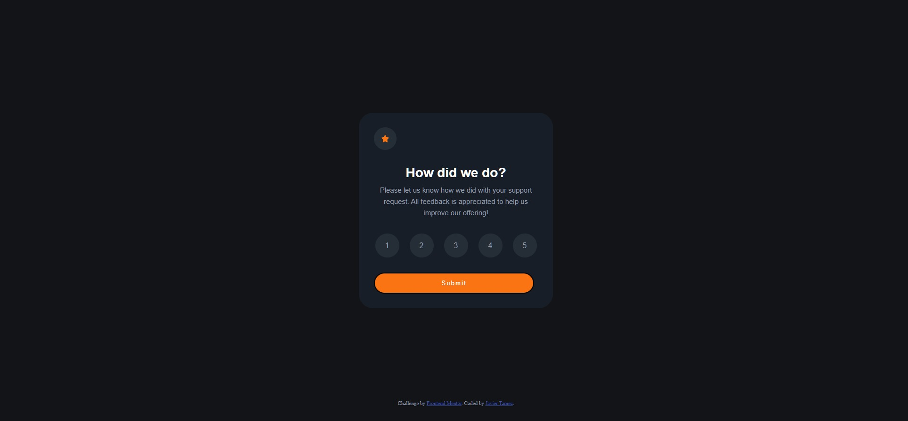
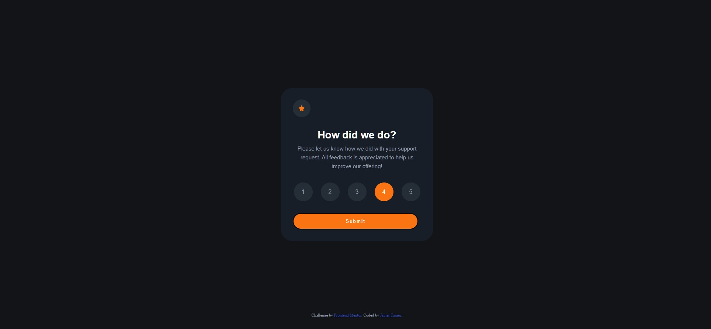
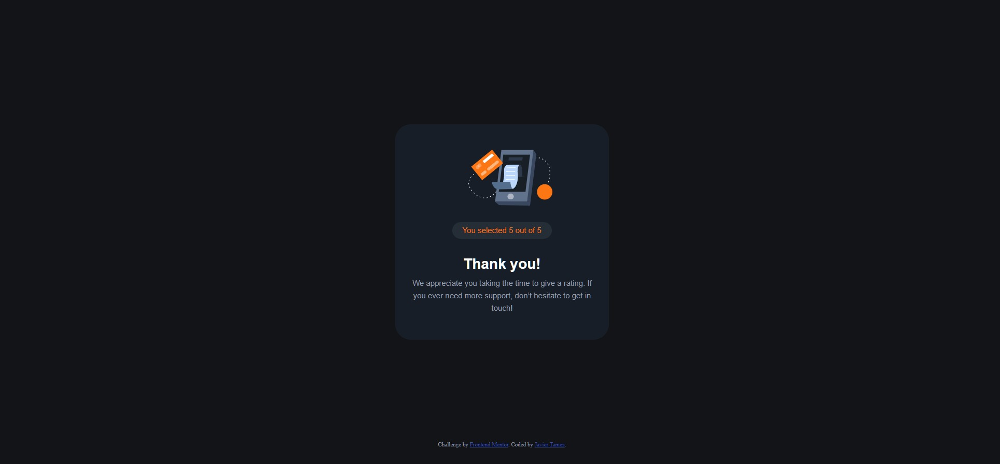
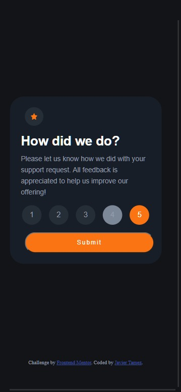
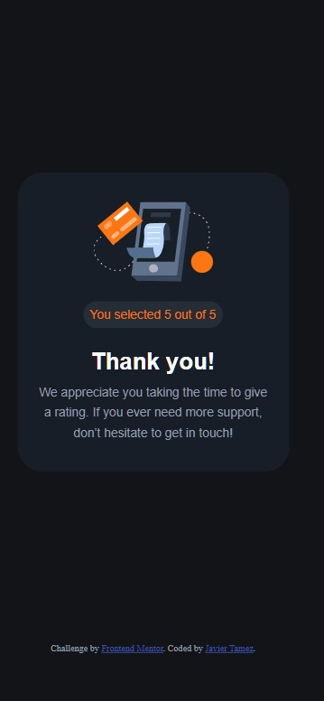

# Frontend Mentor - Interactive rating component solution

This is a solution to the [Interactive rating component challenge on Frontend Mentor](https://www.frontendmentor.io/challenges/interactive-rating-component-koxpeBUmI). Frontend Mentor challenges help you improve your coding skills by building realistic projects. 

## Table of contents

- [Overview](#overview)
  - [The challenge](#the-challenge)
  - [Screenshot](#screenshot)
  - [Links](#links)
- [My process](#my-process)
  - [Built with](#built-with)
  - [What I learned](#what-i-learned)
  - [Continued development](#continued-development)
  - [Useful resources](#useful-resources)
- [Author](#author)

## Overview

### The challenge

Users should be able to:

- View the optimal layout for the app depending on their device's screen size
- See hover states for all interactive elements on the page
- Select and submit a number rating
- See the "Thank you" card state after submitting a rating

### Screenshot

### Links

- Live Site URL: [Live Link](https://prowlinglynx.github.io/FEMentor-interactive-rating-component/)

## My process

### Built with

- Semantic HTML5 markup
- CSS custom properties
- Flexbox
- Javascript

### What I learned

I learned that time estimations are hard. I underestimated the amount of time it would have taken me to implement all the features using plain JS, html, and css.

Up to this point I have used frameworks to implement the interactive portions of my projects. Going through this process without them helped me understand how semantic elements help with code readability.

I recognize now which parts are made trivial using frameworks and how they speed up the process significantly.
- Example: I used a closure variable to maintain the user's selection, when react would use state instead. Likewise, react could render the views using conditional rendering for the project.

Mobile development is hard when you don't add specific plans for it.

### Continued development

I still need to work on deconstructing and planning the project. I did better than the first times, but I realize that my need to revisit code I had considered complete to be a sign for improvement.

Time estimations are still off mostly from not working with plain javascript in a while. I also need to be mindful of the extra time needed to document code, update the readmes as part of the process, and the time for deployment.

On the point of documentation. I added comments after completing the desktop implementation. I realized how helpful they were when I was working on the mobile aspect.

Despite my own criticisms, I did have fun with the project. I enjoy the challenge and frustration that comes from finding knowledge gaps.

### Useful resources

- [MDN](https://developer.mozilla.org/en-US/)
- [W3 schools](https://www.w3schools.com/)
- [Stack Overflow](https://stackoverflow.com/)
- [W3C](https://www.w3.org/) - This one might seem out of place. However if you have questions on why something is the way it is. This is the place to go. I had to go here to understand why some of the answers in stack overflow said you couldn't change the color of the radio buttons natively. In that instance there were some work arounds but I judged them too time intensive.

## Author

- Github - [Javier Tamez @ProwlingLynx](https://github.com/ProwlingLynx)
- Frontend Mentor - [Javier Tamez @ProwlingLynx](https://www.frontendmentor.io/profile/ProwlingLynx)
- Linkedin - [Javier Tamez](https://www.linkedin.com/in/javier-tamez/)
